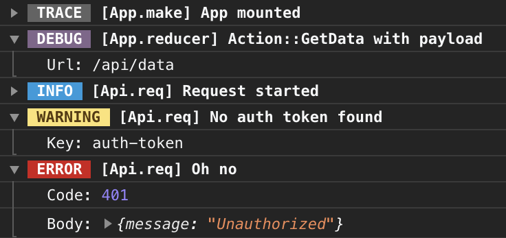

# bs-log

[](https://www.npmjs.com/package/bs-log)
[](https://www.npmjs.com/package/bs-log)

Logging implementation for [ReasonML](https://reasonml.github.io) / [BuckleScript](https://bucklescript.github.io).



## Features
- Zero runtime in production builds.
- Multiple logging levels.
- Customizable verbosity via environment variable.
- Custom loggers.
- `ReasonReact` integration.

## Installation
Get the package:

```shell
# yarn
yarn add bs-log
# or npm
npm install --save bs-log
```

Then add it to `bsconfig.json`:

```json
"bs-dependencies": [
  "bs-log"
],
"ppx-flags": ["bs-log/ppx"]
```

PPX is highly recommended but optional (read details below).

## Usage
There are 4 log levels:
- `debug`
- `info`
- `warn`
- `error`

You can log message of specific level using either PPX or common functions:

```reason
/* ppx */
[%log.info "Info level message"];

/* non-ppx */
Console.info("Info level message");
```

### Additional data
You can add data to log entry like this:

```reason
/* ppx */
[%log.info "Info level message"; ("Foo", 42)];
[%log.info
  "Info level message";
  ("Foo", {"x": 42});
  ("Bar", [1, 2, 3]);
];

/* non-ppx */
Console.infoWithData("Info level message", ("Foo", 42));
Console.infoWithData2(
  "Info level message",
  ("Foo", {"x": 42}),
  ("Bar", [1, 2, 3]),
);
```

Currently, logger can accept up to 7 additional entries.

### Verbosity customization
You can set maximum log level via environment variable `BS_LOG`. This feature is available only when you use PPX.

Let's say you want to log only warnings and errors. To make it happen, run your build like this:

```shell
BS_LOG=warn bsb -clean-world -make-world
```

Available `BS_LOG` values:
- `*`: log everything
- `debug`: basically, the same as `*`
- `info`: log everything except `debug` level messages
- `warn`: log `warn` & `error` messages
- `error`: log `error` messages only
- `off`: don't log anything

If `BS_LOG` is not defined or set to `off`, nothing will be logged and none of the log entries will appear in your JS assets.

### PPX vs non-PPX
PPX gives you ability to customize maximum log level of your build and eliminates unwanted log entries from production builds. Also, it enables `ReasonReact` integration. If for some reason you want to use non-PPX api, then you have to handle elimination of log entries yourself on post-compilation stage.

Default logger compiles log entries to `console.*` method calls so those are discardable via [UglifyJS](https://github.com/mishoo/UglifyJS2#compress-options)/[TerserJS](https://github.com/terser-js/terser#compress-options) or [Babel plugin](https://babeljs.io/docs/en/babel-plugin-transform-remove-console).

### `ReasonReact` integration
With `bs-log`, you can automatically log dispatched actions in your components.

Annotate `reducer` function like this:

```reason
reducer: [@log] (action, state) => switch (action) {
  ...
}
```

In the console, entries appear in the following form: `ModuleName::Action`, where `ModuleName` is value of `__MODULE__` variable. Keep that in mind, when read log for annotated components in sub-modules.

Also, these entries are logged on the `debug` level so none of those will appear in production builds.

### Custom loggers
Default logger served with `bs-log` simply prints data to browser console but you can replace it with your own implementation.

For example, in development, you want to log everything to console, but in production, you want to disable logging to console and send `error` level events to bug tracker.

To implement your own logger, you need to create your own module (e.g. `BugTracker.re`) and set the following environment variables for production build.

```
BS_LOG=error
BS_LOGGER=BugTracker
```

Considering that you want to log only `error` level messages, you need to create functions only for errors logging.

```reason
let error = event => RemoteBugTracker.notify(event);
let errorWithData = (event, (label, data)) =>
  RemoteBugTracker.notify(event, [|(label, data)|]);
let errorWithData2 = (event, (label1, data1), (label2, data2)) =>
  RemoteBugTracker.notify(event, [|(label1, data1), (label2, data2)|]);
/* Up to 7 */
```

You don't have to re-implement all functions from default logger, only the ones you actually use. Don't worry to forget to implement something, if, later on, you will attempt to use unimplemented method it will be compile time error.

## Caveats
**All logging is disabled after file save**<br />
If you run `bsb` via editor integration, make sure editor picked up `BS_LOG` variable. E.g. if you use Atom run it like this:

```shell
BS_LOG=info atom .
```

**Changing value of `BS_LOG`/`BS_LOGGER` doesn't make any effect**<br />
When you change a value of `BS_LOG` and/or `BS_LOGGER`, `-clean-world` before the next build.
